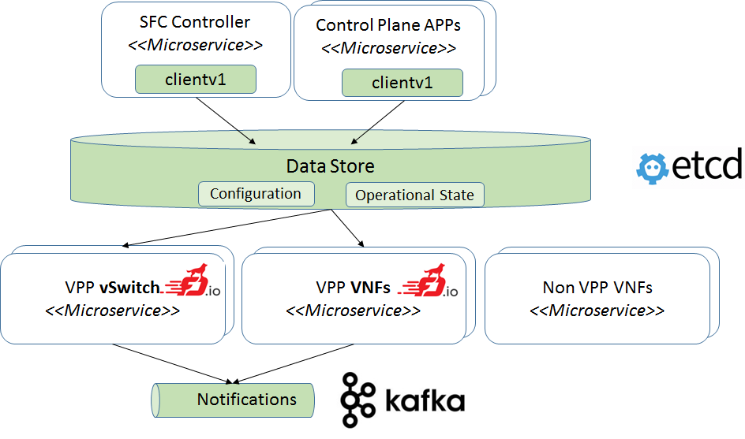

# VPP agent

Please note that the content of the repository is currently work in progress.

The vpp agent is a management tool for vpp built on [cn-infra](github.com/ligato/cn-infra).

The tool used for managing third-party dependencies is [Glide](https://github.com/Masterminds/glide). After adding or updating
a dependency in `glide.yaml` run `make install-dep` to download specified dependencies into the vendor folder. 

If you are interested in contributing, please see the [contribution guidelines](CONTRIBUTING.md).

# Architecture

Brief description:
* SFC Controller - renders desired network stitching configuration for multiple agents to the Data Store
* Control Plane APPs - renders specific VPP configuration for multiple agents to the Data Store
* Client v1 - Control plane can use the Client v1 (VPP Agent Client v1) for submitting configuration for VPP Agents.
              The Client v1 is based on generated GO structures from protobuf messages & set of helper methods
              that generates keys and store the data to key the value Data Store.
* Data Store (ETCD, Redis, etc.) to:
  * store the VPP configuration
  * operational state (network counters & statistics, errors...)
* VPP vSwitch - privileged container that cross connects multiple VNFs
* VPP VNF - container that runs VPP that acts as Virtual Network Function 
* Non VPP VNF - non VPP containers can interact together with VPP containers (see below MEMIFs, VETH)
* Messaging - AD-HOC events (e.g. link UP/Down)

VPP Agent was designed with following principal requirements:
* Modular design with API contract
* Cloud native
* Fault tolerant
* Rapid deployment
* High performance & minimal footprint

## VPP Agent Plugins:

 
* Default VPP Plugins - provides abstraction on top of VPP binary API for:
  * NET Interface - Network interfaces configuration (Gigi ETH, MEMIF, AF_Packet, VXLAN, Loopback...)
  * L2 - Bridge Domains, FIBs...
  * L3 - IP Routes, VRFs...
  * ACL - configures VPP ACL Plugin
* GOVPP - allows other plugins to access VPP independently on each other by means of connection multiplexing
* Linux (VETH) - configures Linux Virtual Ethernets
* Core - lifecycle management of plugins (loading, initialization, unloading) see [cn-infra](https://github.com/ligato/cn-infra)

# Quickstart(TBD)
1. Run VPP agent in Docker image
2. Configure the VPP agent using agentctl
3. Check the configurtion (using agentctl or directly using VPP console)

# Next Steps(TBD)
* Deployment
* Extensibility
* Design