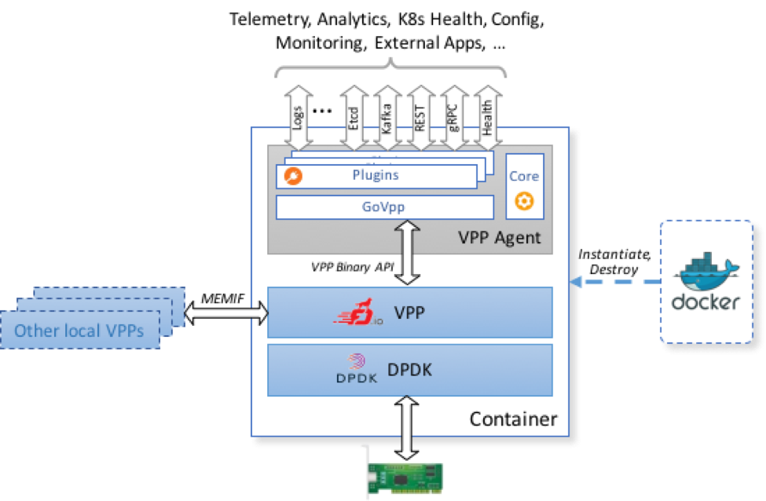

# VPP Agent

[](https://travis-ci.org/ligato/vpp-agent)
[](https://coveralls.io/github/ligato/vpp-agent?branch=master)
[](https://goreportcard.com/report/github.com/ligato/vpp-agent)
[](https://godoc.org/github.com/ligato/vpp-agent)
[](https://github.com/ligato/vpp-agent/blob/master/LICENSE)

Please note that the content of this repository is currently **WORK IN PROGRESS**.

The VPP Agent is a Golang implentation of a control/management plane for 
[VPP][1] based cloud-native [Virtual Network Functions][2] (VNFs). 

## Architecture
The VPP Agent is built on top of the CN-Infra cloud-native platform. It
is basically a set of VPP-specific plugins that use the CN-Infra platform
to interact with other services / microservices in the cloud (e.g. a KV 
data store, messaging, log warehouse, etc.). The VPP Agent provides a 
model-driven, high-level API to VPP functionality. Clients that consume
this API may be external (via REST or gRPC API, Etcd or a message bus), 
or other other App/Extension plugins in a larger CN-Infra based 
application/VNF. 

The VNF Agent architecture is shown in the following figure: 


Each (northboud) VPP API - L2, L3, ACL, ... - is implemented by a specific
VNF Agent plugin, which translates northbound API calls/operations into 
(southbound) low level VPP Binary API calls. Northbound APIs are defined 
using [protobufs][3], which allow for the same functionality to be accessible
over multiple transport protocols (HTTP, gRPC, Etcd, ...). Plugins use the 
[GoVPP library][4] to interact with the VPP.

The following figure shows a cloud-native VNF with its data plane based on
VPP/DPDK and its management / control planes based on the VNF agent:




## Plugins
 
The set of plugins in the VPP Agent id as follows:
* [Default VPP Plugins][5] - plugins providing northbound APIs to "default" 
  VPP functionality (i.e. VPP functions available "out-of-the-box"): 
  * [NET Interfaces][6] - network interface configuration (PCI Ethernet, MEMIF, 
    AF_Packet, VXLAN, Loopback...) + BFD
  * [L2][7] - Bridge Domains, L2 cross-connects
  * [L3][8] - IP Routes, VRFs...
  * [ACL][9] - VPP access lists (VPP ACL plugin)
* [GOVPPmux][10] - plugin wrapper arounf GoVPP. Multiplexes plugins' access to
  VPP on a single connection.
* [Linux][11] (VETH) - allows optional configuration of Linux virtual ethernet 
  interfaces
* [CN-Infra datasync][12] - data synchronization after HA events
* [CN-Infra core][13] - lifecycle management of plugins (loading, 
  initialization, unloading)

## Tools
The VPP agent repository also contains tools for building and troubleshooting 
of VNFs based on the VPP Agent:

* [agentctl](cmd/agentctl) - a CLI tool that shows the state of a set of VPP agents 
   can configure the agents
* [Docker based development environment](docker)

## Quickstart
For a quick start with the VPP Agent, you can use pre-build Docker images with the Agent and VPP
on [Dockerhub](https://hub.docker.com/r/ligato/vpp-agent/).

0. Run ETCD and Kafka on your host (e.g. in Docker [using this procedure](docker/dev_vpp_agent/README.md#running-etcd-server-on-local-host)).

1. Run VPP + VPP Agent in a Docker image:
```
docker pull ligato/vpp-agent
docker run -it --name vpp --rm ligato/vpp-agent
```

2. Configure the VPP agent using agentctl:
```
docker exec -it vpp agentctl -h
```

3. Check the configuration (using agentctl or directly using VPP console):
```
docker exec -it vpp agentctl show
docker exec -it vpp vppctl
```

## Next Steps
Read the README for the [Development Docker Image](docker/dev_vpp_agent/README.md) for more details.

GoDoc can be browsed [online](https://godoc.org/github.com/ligato/vpp-agent).

### Deployment:
[](docs/Deployment.md)

### Extensibility:
[](https://github.com/ligato/cn-sample-service)

### Design & architecture:
[](docs/Design.md)


## Contribution:
If you are interested in contributing, please see the [contribution guidelines](CONTRIBUTING.md).

[1]: https://fd.io/
[2]: https://github.com/ligato/cn-infra/blob/master/docs/readmes/cn_virtual_function.md
[3]: https://developers.google.com/protocol-buffers/
[4]: https://wiki.fd.io/view/GoVPP
[5]: plugins/defaultplugins
[6]: plugins/defaultplugins/ifplugin
[7]: plugins/defaultplugins/l2plugin
[8]: plugins/defaultplugins/l3plugin
[9]: plugins/defaultplugins/aclplugin
[10]: plugins/govppmux
[11]: plugins/linuxplugin
[12]: https://github.com/ligato/cn-infra/tree/master/datasync
[13]: https://github.com/ligato/cn-infra/tree/master/core